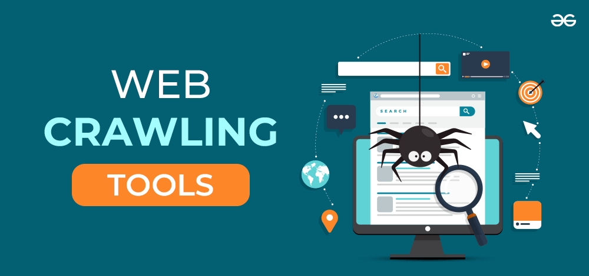
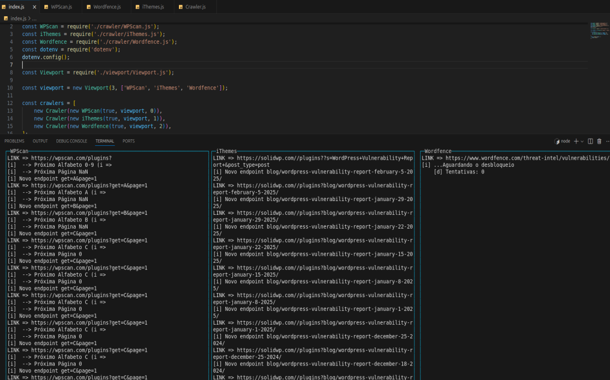

    

<h1 align='center'>
    WebCrawler for discovery WordPress vulnerabilities
</h1>

## Usage

Do you want to use this app? Please contact me.

## Screenshoot

    

## Author

LinkedIn: [Marcos Vitti](https://www.linkedin.com/in/marcos-vitti-31529a17a/) 
Portfolio: [marcosvitti.github.io](https://marcosvitti.github.io/) 

